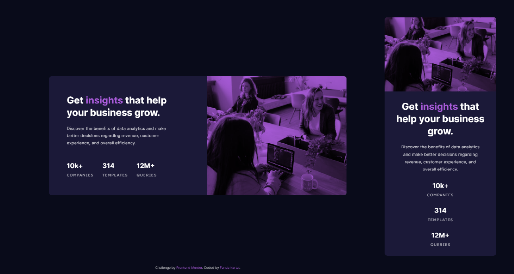

# Frontend Mentor - Stats Preview Card Component Solution

This is a solution to the [Stats Preview Card Component Challenge on Frontend Mentor](https://www.frontendmentor.io/challenges/stats-preview-card-component-8JqbgoU62).

## Table of contents

- [Overview](#overview)
  - [The challenge](#the-challenge)
  - [Screenshot](#screenshot)
  - [Links](#links)
- [My process](#my-process)
  - [Built with](#built-with)
  - [What I learned](#what-i-learned)
  - [Useful resources](#useful-resources)

## Overview

### The challenge

Users should be able to:

- View the optimal layout depending on their device's screen size

### Screenshot



### Links

- Solution URL: [https://www.frontendmentor.io/solutions/stats-preview-card-component-using-scss-OfCOO0GhZ](https://www.frontendmentor.io/solutions/stats-preview-card-component-using-scss-OfCOO0GhZ)
- Live Site URL: [https://fundakartal.github.io/stats-preview-card/](https://fundakartal.github.io/stats-preview-card/)

## My process

### Built with

- Semantic HTML5 markup
- SCSS custom properties
- CSS Flexbox
- Mobile-first workflow

### What I learned

- mix-blend-mode 

This CSS property helped me to achieve the desirable result of getting as close to the original design as possible.

```css
&-overlay {
      background-color: $soft-violet;
      height: 250px;
      mix-blend-mode: multiply;
      border-radius: 10px 10px 0 0;
    }
```

-gulp.js >> Leverage gulp and the flexibility of JavaScript to automate slow, repetitive workflows and compose them into efficient build pipelines.

Even though it is a small project with a single component, I wanted to use gulp.js. It's been good for me as a preparation for other big projects.

### Useful resources

- [mix-blend-mode @ MDN Web Docs](https://developer.mozilla.org/en-US/docs/Web/CSS/mix-blend-mode)

- [mix-blend-mode @ CSS-TRICKS](https://css-tricks.com/almanac/properties/m/mix-blend-mode/)


## Author

- Frontend Mentor - [@fundakartal](https://www.frontendmentor.io/profile/fundakartal)
- Twitter - [@fundakartal](https://twitter.com/fundakartaI)